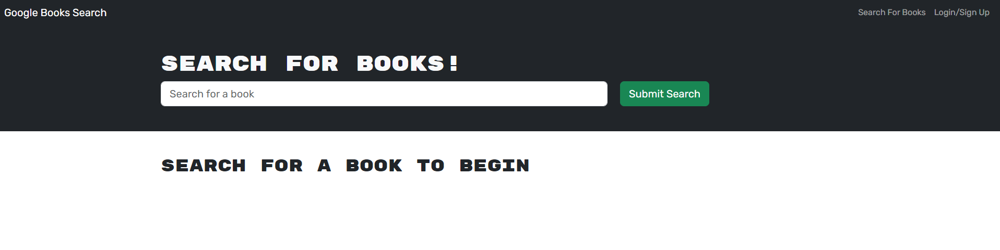

# book-search-engine

A full-stack book search engine uses google api to find the books. Uses mongoDB and graphql for databases and react on the client side.

Uses jsonwebtoken to save the token to local storage for each user

## Installation

type npm i to install dependiences

## Usage

Create an account. Once logged in you can search for any book from the google api and you are able to save a book you searched or you can also delete it.

website: https://rocky-inlet-59074-db0ff4c6b944.herokuapp.com/

## Credits

N/A

## License

N/A